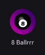
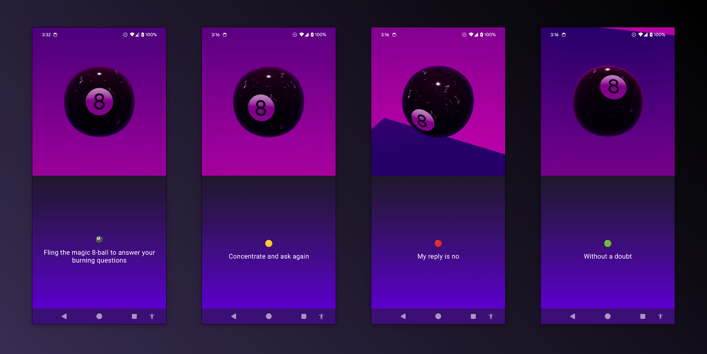

# Magic 8Ballrrr Android Jetpack Compose

This example Jetpack Compose app uses [Magic8Ballrrr](https://github.com/techygrrrl/Magic8Ballrrr).

Just fling the magic 8 ball to get some great advice.

## Credits

- "Eight Ball" 3D model by [Routine Studio on Sketchfab](https://sketchfab.com/3d-models/eight-ball-24a32adaf6014528ad71a1de9af6b084)
- "Pool ball number 8 sphere" by [Kjrstie on Pixabay](https://pixabay.com/vectors/pool-ball-number-8-sphere-ball-923833/)
- 3D model rendered by the [SceneView](https://github.com/SceneView/sceneview-android) Android library
- Predictions and advice from my Kotlin library [Magic8Ballrrr](https://github.com/techygrrrl/Magic8Ballrrr)
